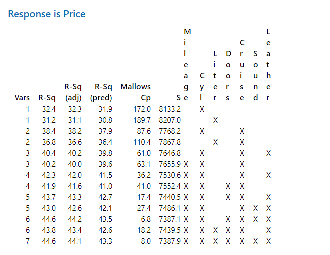

## Stat2 -- Chapter 4 Homework

### Ryan Bruno

```{r setup, echo=FALSE, message=FALSE}
library(tidyverse)

data <- read.csv("Cars.csv", header = TRUE);
#str(data)
```

### Question One

#### Step One

Model: $Price = \beta_{0} + \beta_{1} Cyl + \beta_{2} Liter + \beta_{3} Doors + \beta_{4} Cruise + \beta_{5} Sound + \beta_{6} Leather$

| Variable | t-value | p-value | Remove? |
|---|---|---|:---:|
| Cyl | 5.663 | ~0 | |
| Liter | -1.032 | 0.30225 | * |
| Doors | -4.691 | ~0 | |
| Cruise | 9.235 | ~0 | |
| Sound | -3.270 | 0.00112 | |
| Leather | 5.459 | ~0 | |

```{r q1step1, echo=FALSE, eval=FALSE}
summary(lm(Price~Cyl+Liter+Doors+Cruise+Sound+Leather, data = data))
```

#### Step Two

Model: $Price = \beta_{0} + \beta_{1} Cyl + \beta_{2}Doors + \beta_{3} Cruise + \beta_{4} Sound + \beta_{5} Leather$

| Variable | t-value | p-value | Remove? |
|---|---|---|:---:|
| Cyl | 15.742 | ~0 | |
| Doors | -4.583 | ~0 | |
| Cruise | 9.181 | ~0 | |
| Sound | -3.336 | 0.000889 | |
| Leather | 5.421 | ~0 | |

Since all p-values are low (<0.05) we are done.

Final Model:

Price = 3,659.8 + 3,247.2 Cyl - 1,436.9 Doors + 6,079.7 Cruise - 1,935.8 Sound + 3,292.2 Leather

```{r q1step2, echo=FALSE, eval=FALSE}
summary(lm(Price~Cyl+Doors+Cruise+Sound+Leather, data = data))
```

### Question Two

The best model given in the best subsets table has 6 variables; using every one but Liter. I picked this model because its Cp value is the closest to the amount of variables then everyother model.



### Question Three

#### Part a

Yes this is shown in the best subsets table by how many models a variable is apart of. Variables that are not in many models are less important.

#### Part b

In question one the variable Liter was the first and only variable removed due to its low p-value. In question two we can see Liter is not apart of many models but it is apart of a few and is apart or one more then sound. This makes the best subset method better because it shows us that Liter is useful in some models.

### Question Four

```{r q4, echo=FALSE, eval=TRUE}
data <- data %>%
    mutate(TPrice = log(Price))
```

#### Part a

After applying a log to price there does appear to be a linear relationship in the medians from TPrice to Type and TPrice to Model.

```{r q4a, echo=FALSE, eval=FALSE}
data <- data %>%
    mutate(TPrice = log(Price))

ggplot(data, aes(y = TPrice, x = Make)) + 
    geom_boxplot()

ggplot(data, aes(y = TPrice, x = Model)) + 
    geom_boxplot()

ggplot(data, aes(y = TPrice, x = Trim)) + 
    geom_boxplot()
ggplot(data, aes(y = TPrice, x = Type)) + 
    geom_boxplot()
```

#### Part b

The possible outcomes for the Cadillac variable are either 1 meaning it is a Cadillac or 0 meaning it is not.


```{r q4b, echo=FALSE, eval=TRUE}
data <- data %>%
    mutate(Buick = ifelse(Make == "Buick", 1, 0),
           Cadillac = ifelse(Make == "Cadillac", 1, 0),
           Chevrolet = ifelse(Make == "Chevrolet", 1, 0),
           Pontiac = ifelse(Make == "Pontiac", 1, 0),
           SAAB = ifelse(Make == "SAAB", 1, 0),
           Saturn = ifelse(Make == "Saturn", 1, 0))
    
```

#### Part c

TPrice = 9.2216 + 0.4407 Cadillac - 0.1266 Chevrolet - 0.0969 Pontiac + 0.5512 SAAB - 0.0959 Saturn + 0.3678 Convertible + 0.0505 Coupe + 0.0411 Sedan + 0.2049 Wagon + 0.2205 Liter + 0.01731 Cruise + 0.01203 Sound + 0.01441 Leather - 0.000008 Mileage (Doors was removed)

The normality and variance looks normal.

```{r q4c1, echo=FALSE, eval=TRUE}
data <- data %>%
    mutate(Convertible = ifelse(Type == "Convertible", 1, 0),
           Coupe = ifelse(Type == "Coupe", 1, 0),
           Hatchback = ifelse(Type == "Hatchback", 1, 0),
           Sedan = ifelse(Type == "Sedan", 1, 0),
           Wagon = ifelse(Type == "Wagon", 1, 0))
```

```{r q4c2, echo=FALSE, eval=FALSE}
summary(lm(TPrice ~ Cadillac + Chevrolet + Pontiac + SAAB + Saturn + 
   Convertible + Coupe + Sedan + Wagon + Liter + Doors + Cruise + Sound +
   Leather + Mileage, data = data))
```

### Question Five

My Model:

TPrice = 10.0957 - 0.000008 Mileage + 0.5923 Cadillac - 0.3123 Chevrolet - 0.1594 Pontiac + 0.2371 SAAB - 0.4231 Sadurn + 0.4502 Covertible + 0.0776 Coupe - 0.1037 Hatchback

I removed some correlated variables, ran the best subsets(shown below), and picked one with a Cp close to the number of vars but removed some variables out.


